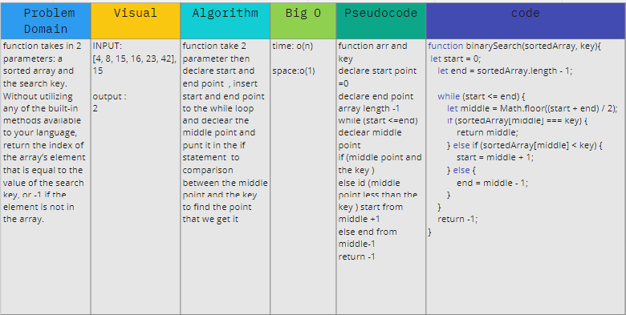

# Binary Search of Sorted Array
- function takes in 2 parameters: a sorted array and the search key. Without utilizing any of the built-in methods available to your language, return the index of the array’s element that is equal to the value of the search key, or -1 if the element is not in the array.

## Whiteboard Process

## Approach & Efficiency
<!-- What approach did you take? Discuss Why. What is the Big O space/time for this approach? -->
- at the begining i try to understand the problem then start with write the code when i try it at the replet and everything is going will i start with Algorithm and Pseudocode . 
- it take from me arount 1 hour 