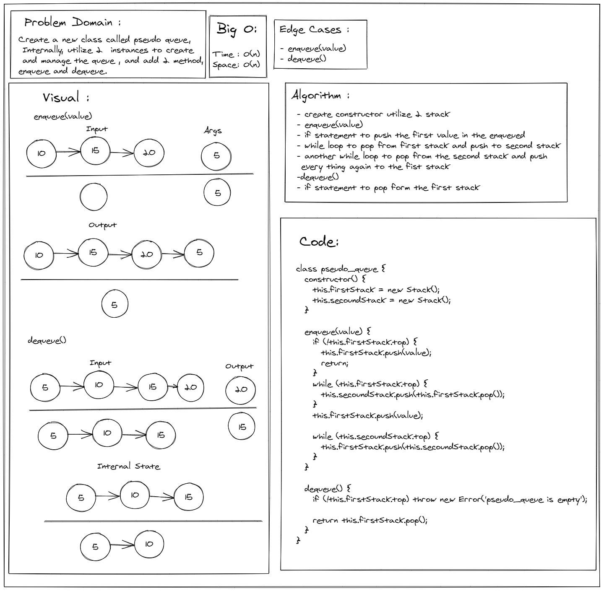
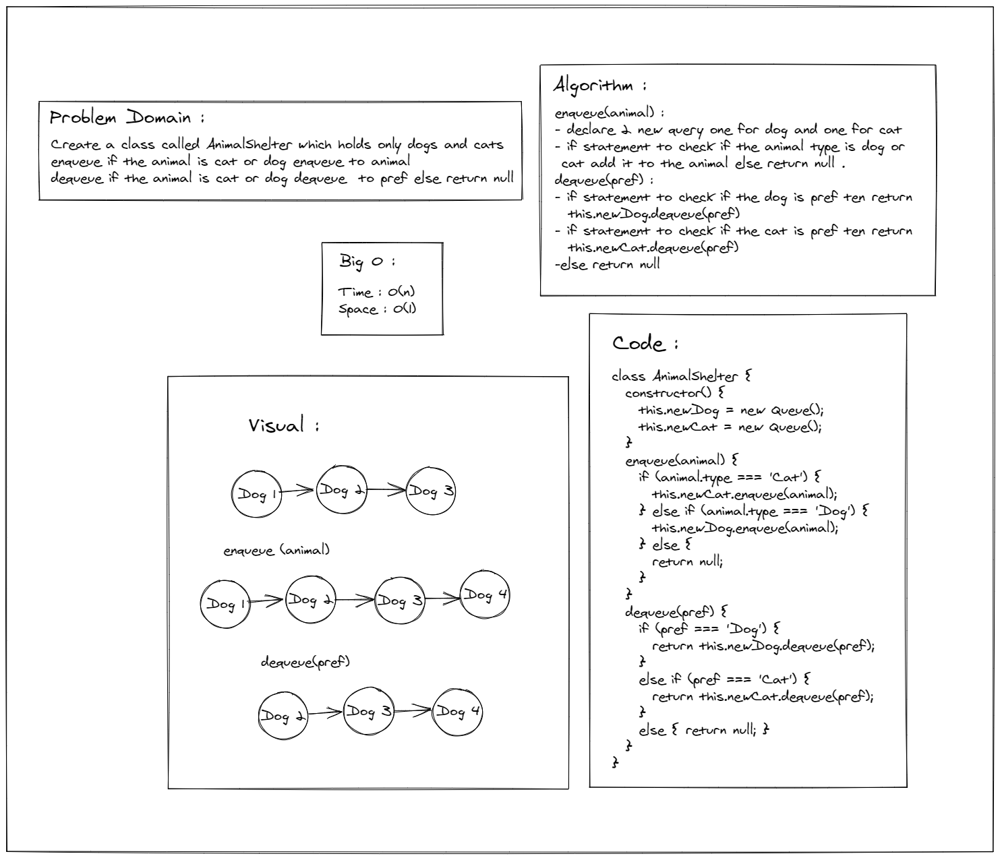

# Stacks and Queues
- Stacks: it is a container of objects that are inserted and removed according to the last-in first-out (LIFO) principle. 
- Queues: it is a container of objects (a linear collection) that are inserted and removed according to the first-in first-out (FIFO) principle.

## pseudo_queue: 

## animal-shelter: 

